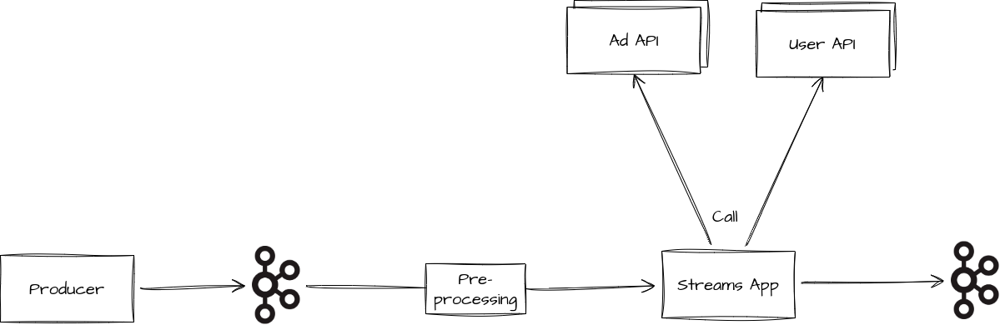
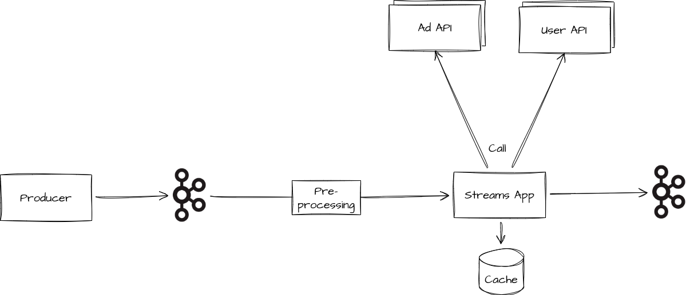
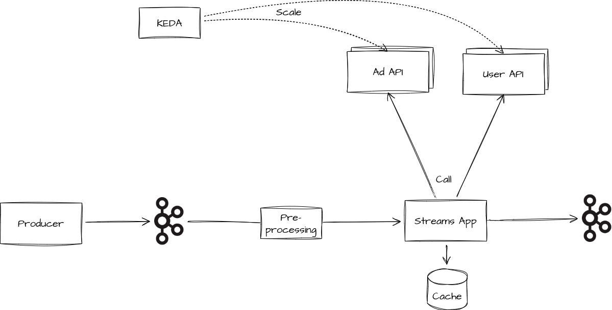
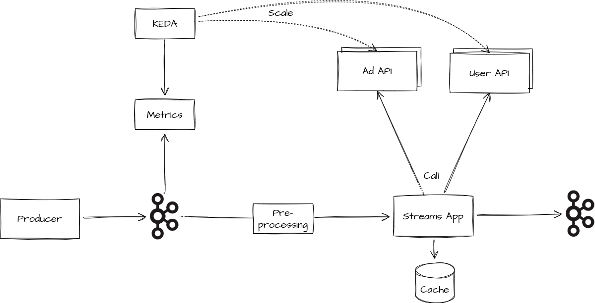

# Timely Auto-Scaling of Kafka Streams Pipelines with Remotely Connected APIs

## Abstract

Calling APIs over the network from Kafka Streams is often a necessary evil:
Although it can incur significant costs by blocking the processing and thus making our pipelines less reliable,
we are sometimes forced to integrate business process-related microservices or
machine learning models and other technology that does not pair well with the JVM.
While we scale the Kafka Streams applications and the services in Kubernetes to avoid blocked pipelines,
it is often too late, as the scaling traditionally relies on metrics like the consumer group lag or number of HTTP requests.

In this talk, we first give an overview of the caveats when integrating such services in Kafka Streams and basic approaches for mitigating
those.
Second, we present our solution for the timely scaling of complex Kafka Streams pipelines in conjunction with remotely connected APIs.
In addition to the well-known metrics, we take further dimensions into account.
Powered by Kafka Streams, we observe our data stream, extract metadata, aggregate statistics, and finally expose them as external metrics.
We integrate this with auto-scaling frameworks such as KEDA to reliably scale our pipelines just in time.

## Setup

## Pipelines

### Basic Pipeline

---

### Cached Pipeline

---

### Pipeline with Auto-Scaling

---

### Pipeline with Timely Auto-Scaling

---
